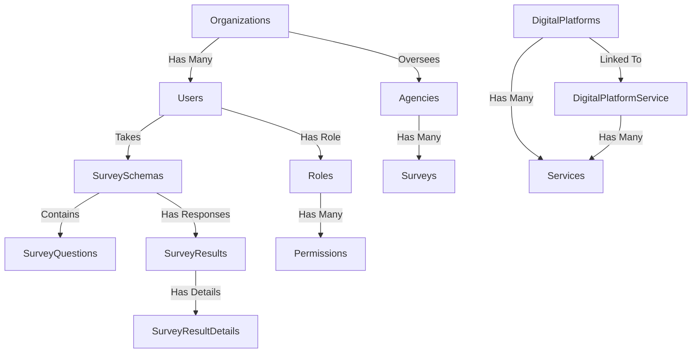

# Database Documentation

## Overview

The database for the **Digital Services Survey** system is designed to manage survey-related data, users, roles, permissions, and digital platforms. This document provides an overview of the database structure, migrations, models, and seeders.

---

## Database Schema Overview

The database consists of several key tables:

| Table Name              | Description                                        |
| ----------------------- | -------------------------------------------------- |
| `users`                 | Stores user information and authentication details |
| `roles`                 | Defines user roles (e.g., Admin, Manager)          |
| `permissions`           | Stores system permissions for roles                |
| `organizations`         | Stores details about organizations                 |
| `agencies`              | Stores government agencies linked to surveys       |
| `teams`                 | Defines user teams and their roles                 |
| `survey_schemas`        | Stores different survey structures                 |
| `survey_questions`      | Stores questions linked to surveys                 |
| `survey_results`        | Stores responses from users                        |
| `survey_result_details` | Detailed breakdown of survey responses             |
| `digital_platforms`     | Stores details of digital services being surveyed  |
| `services`              | Stores service-related information                 |
| `activity_logs`         | Tracks user actions for audit purposes             |

---

## Table Structures

### `users`
| Column Name  | Type        | Description                                              |
| ------------ | ----------- | -------------------------------------------------------- |
| `id`         | UUID        | Unique identifier for each user                          |
| `name`       | String      | Full name of the user                                    |
| `email`      | String      | User email address (unique)                              |
| `password`   | String      | Encrypted password                                       |
| `role_id`    | Foreign Key | Links to the `roles` table to determine user permissions |
| `created_at` | Timestamp   | Record creation timestamp                                |
| `updated_at` | Timestamp   | Last update timestamp                                    |

### `roles`
| Column Name  | Type      | Description                     |
| ------------ | --------- | ------------------------------- |
| `id`         | UUID      | Unique identifier for each role |
| `name`       | String    | Role name (Admin, User, etc.)   |
| `created_at` | Timestamp | Record creation timestamp       |
| `updated_at` | Timestamp | Last update timestamp           |

### `permissions`
| Column Name  | Type      | Description                                |
| ------------ | --------- | ------------------------------------------ |
| `id`         | UUID      | Unique identifier for each permission     |
| `name`       | String    | Name of the permission                    |
| `created_at` | Timestamp | Record creation timestamp                 |
| `updated_at` | Timestamp | Last update timestamp                     |

### `organizations`
| Column Name  | Type      | Description                    |
| ------------ | --------- | ------------------------------ |
| `id`         | UUID      | Unique identifier for organization |
| `name`       | String    | Organization name              |
| `created_at` | Timestamp | Record creation timestamp      |
| `updated_at` | Timestamp | Last update timestamp          |

### `agencies`
| Column Name  | Type      | Description                         |
| ------------ | --------- | ----------------------------------- |
| `id`         | UUID      | Unique identifier for agency       |
| `name`       | String    | Name of the agency                |
| `created_at` | Timestamp | Record creation timestamp         |
| `updated_at` | Timestamp | Last update timestamp             |

### `survey_schemas`
| Column Name   | Type      | Description                        |
| ------------- | --------- | ---------------------------------- |
| `id`          | UUID      | Unique identifier for each survey  |
| `title`       | String    | Name of the survey                 |
| `description` | Text      | Detailed description of the survey |
| `created_at`  | Timestamp | Record creation timestamp          |
| `updated_at`  | Timestamp | Last update timestamp              |

### `survey_questions`
| Column Name  | Type        | Description                         |
| ------------ | ----------- | ----------------------------------- |
| `id`         | UUID        | Unique identifier for each question |
| `survey_id`  | Foreign Key | Links to the `survey_schemas` table |
| `question`   | Text        | Question content                    |
| `type`       | String      | Question type (MCQ, Text, etc.)     |
| `created_at` | Timestamp   | Record creation timestamp           |

### `survey_results`
| Column Name  | Type        | Description                                    |
| ------------ | ----------- | ---------------------------------------------- |
| `id`         | UUID        | Unique identifier for each response            |
| `survey_id`  | Foreign Key | Links to the `survey_schemas` table            |
| `user_id`    | Foreign Key | Links to the `users` table to track respondent |
| `created_at` | Timestamp   | Record creation timestamp                      |

### `survey_result_details`
| Column Name        | Type        | Description                                |
| ------------------ | ----------- | ------------------------------------------ |
| `id`               | UUID        | Unique identifier for each response detail |
| `survey_result_id` | Foreign Key | Links to the `survey_results` table        |
| `question_id`      | Foreign Key | Links to the `survey_questions` table      |
| `answer`           | Text        | The respondent’s answer                    |
| `created_at`       | Timestamp   | Record creation timestamp                  |

### `digital_platforms`
| Column Name  | Type      | Description                   |
| ------------ | --------- | ----------------------------- |
| `id`         | UUID      | Unique identifier for platform |
| `name`       | String    | Name of the platform         |
| `created_at` | Timestamp | Record creation timestamp    |
| `updated_at` | Timestamp | Last update timestamp        |

### `services`
| Column Name  | Type      | Description                     |
| ------------ | --------- | ------------------------------- |
| `id`         | UUID      | Unique identifier for service  |
| `name`       | String    | Name of the service           |
| `created_at` | Timestamp | Record creation timestamp     |
| `updated_at` | Timestamp | Last update timestamp         |

### `activity_logs`
| Column Name  | Type      | Description                          |
| ------------ | --------- | ------------------------------------ |
| `id`         | UUID      | Unique identifier for activity log  |
| `user_id`    | Foreign Key | Links to the `users` table         |
| `action`     | String    | Action performed by user           |
| `created_at` | Timestamp | Record creation timestamp          |

---

## Models and Functions

Each model represents a database table and contains various functions that facilitate database interactions. Below are the key models with detailed descriptions of their functions:

### **User.php**

The `User` model represents users of the system and manages authentication, roles, and related relationships.

- `roles()`: Defines a many-to-many relationship with roles, allowing users to have multiple roles.
- `organization()`: Defines a `belongsTo` relationship with organizations, linking each user to a specific organization.
- `surveys()`: Defines a `hasMany` relationship with `SurveySchema`, linking users with the surveys they created.
- `logs()`: Retrieves user-related activity logs for auditing purposes.

### **Role.php**

Manages user roles and permissions within the system.

- `permissions()`: Establishes a many-to-many relationship with permissions.
- `users()`: Retrieves all users assigned to a specific role.

### **Permission.php**

Defines system-wide permissions.

- `roles()`: Retrieves roles that have been assigned a specific permission.

### **SurveySchema.php**

Represents the structure of a survey and its associated questions.

- `questions()`: Establishes a `hasMany` relationship with `SurveyQuestion`.
- `responses()`: Retrieves responses submitted for the survey.
- `creator()`: Links the survey to the user who created it.

### **SurveyQuestion.php**

Handles individual survey questions and their related responses.

- `survey()`: Defines a `belongsTo` relationship with `SurveySchema`.
- `responses()`: Retrieves responses related to a specific question.

### **SurveyResult.php**

Stores user responses to surveys.

- `user()`: Defines a `belongsTo` relationship with `User`, linking responses to the respondent.
- `details()`: Establishes a `hasMany` relationship with `SurveyResultDetail`.
- `survey()`: Links each response to a specific survey.

### **SurveyResultDetail.php**

Stores detailed responses to survey questions.

- `survey_result()`: Defines a `belongsTo` relationship with `SurveyResult`.
- `question()`: Retrieves the associated survey question.

### **Organization.php**

Represents organizations linked to surveys and users.

- `users()`: Retrieves all users linked to the organization.
- `surveys()`: Fetches all surveys associated with the organization.

### **Agency.php**

Handles government agencies linked to surveys.

- `surveys()`: Fetches all surveys managed by the agency.

### **ActivityLog.php**

Stores audit logs for user actions.

- `user()`: Retrieves the user associated with a specific action log.

---

## Entity Relationship Diagram (ERD)

Below is an ERD representing the relationships between tables:

---

## Conclusion

This document serves as a reference for understanding the database structure of the **Digital Services Survey** system. Any updates to the schema should be documented accordingly.
